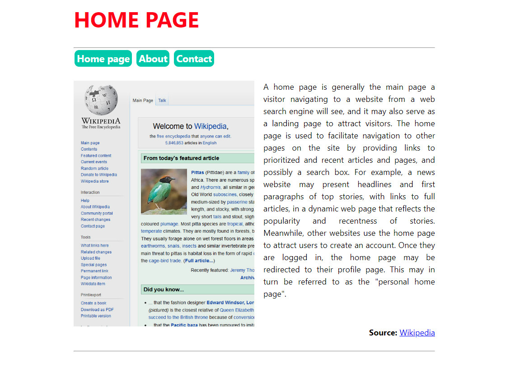
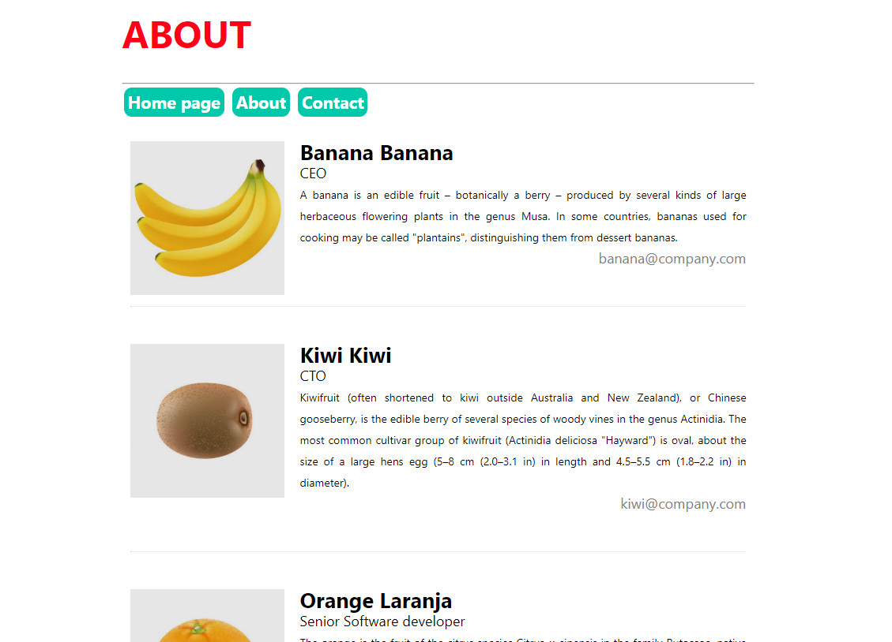
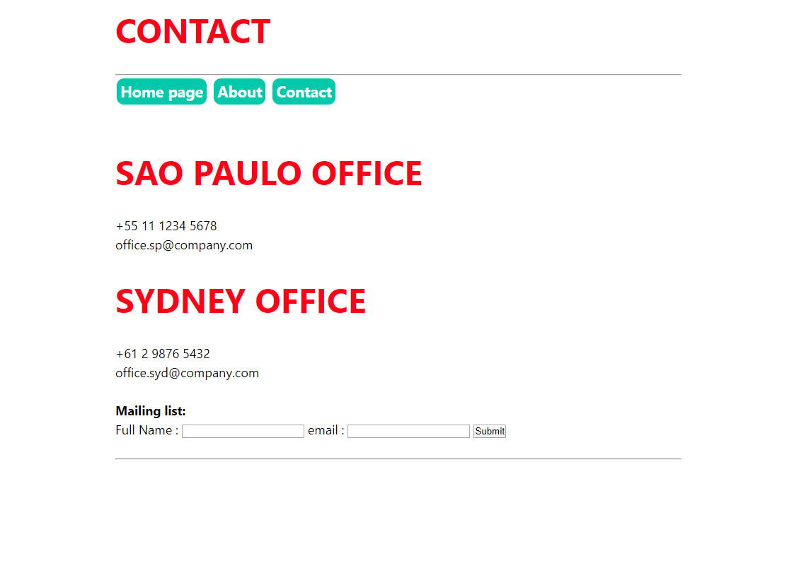

# Basic App - Flask

This is a simple project that demonstrates an example of project structure for a Flask app, using *templates*, *static* files, *database*, *requests* and so.

After creating/activating a proper environment and installing all dependencies, run the app by executing:

```
$ python app.py
```

## Project structure
Home page (**Template**, **static** ..)



About (**Template**, **static**, **database** ..)



Contact (**Template**, **static**, **database**, **requests** ..)

